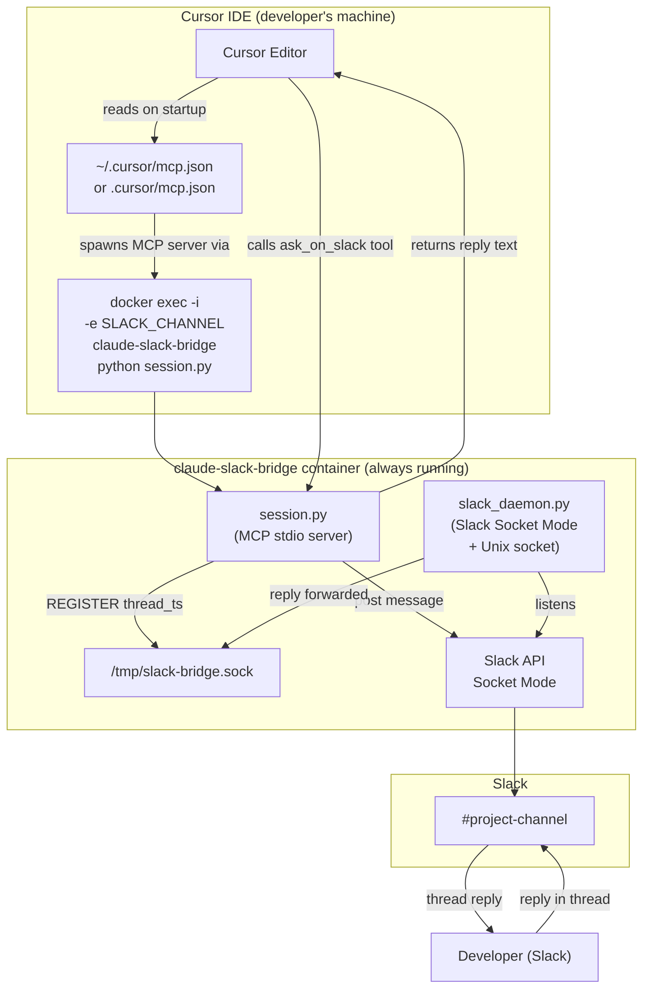

# add-to-cursor — System / Architecture Design

## Goal & Scope

The `add-to-cursor` feature adds first-class support for **Cursor IDE** as an MCP client for the claude-slack-bridge daemon. Currently the bridge is documented and tested exclusively for Claude Code (via `.mcp.json` + `docker exec`). Cursor IDE has native MCP support with its own configuration format (`~/.cursor/mcp.json` or a project-level `.cursor/mcp.json`), and users who work in Cursor want the same Slack-bridge capability without switching editors.

The scope is: provide a clear setup path for Cursor users to connect the existing daemon to their Cursor workspace, and update all relevant documentation to reflect Cursor as a supported MCP client alongside Claude Code. The daemon itself (`session.py`, `slack_daemon.py`, `mcp_server.py`) requires no runtime changes — it already speaks the MCP stdio protocol, which Cursor consumes identically to Claude Code.

**Out of scope:** changes to the daemon's Slack handling, project routing, security model, or worktree support. This feature is a client-setup addition, not a daemon behaviour change.

**Open question (deferred to Limitations):** Whether the feature also requires or includes a Cursor-specific CLAUDE.md equivalent (Cursor uses `.cursorrules` or `AGENTS.md`) to enforce the Slack-only communication rule at the Cursor side.

---

## System Diagram



---

## Stack

| Layer | Technology | Why chosen |
|---|---|---|
| MCP client | Cursor IDE (MCP support built-in) | Target client for this feature; Cursor speaks the same MCP stdio protocol as Claude Code |
| MCP server / stdio | `session.py` (existing, unchanged) | Already implements MCP stdio; no new transport needed |
| Configuration format | JSON (Cursor `mcp.json`) | Cursor's native MCP config format; mirrors Claude Code's `.mcp.json` structure |
| Containerization | Docker (existing) | Daemon already runs in Docker; Cursor invokes `docker exec` identically to Claude Code |
| Documentation | Markdown (`docs/cursor-setup.md`) | Consistent with existing `docs/slack-setup.md` and `docs/mcp-client-setup.md` patterns |
| AGENTS.md / .cursorrules | TBD (see Limitations) | Cursor's equivalent of CLAUDE.md for enforcing runtime communication rules |

---

## File Changes / File Structure

```
claude-slack-two-way/
├── docs/
│   ├── cursor-setup.md          [NEW] Step-by-step guide for connecting Cursor to the bridge
│   ├── slack-setup.md           [unchanged]
│   ├── mcp-client-setup.md      [MODIFIED] Add "Cursor" section and link to cursor-setup.md
│   └── github-setup.md          [unchanged]
├── README.md                    [MODIFIED] Add Cursor to supported clients list and quickstart
└── (no src/ changes required)
```

### `docs/cursor-setup.md` (new)

Mirrors the structure of `docs/mcp-client-setup.md` but targets Cursor's config format. Covers:

1. **Prerequisites** — daemon running, Cursor version with MCP support (≥ 0.43 or current stable)
2. **Step 1 — Create `~/.cursor/mcp.json`** (global) or `.cursor/mcp.json` (project-level), with the same `docker exec` invocation as Claude Code's `.mcp.json`:
   ```json
   {
     "mcpServers": {
       "claude-slack-bridge": {
         "command": "docker",
         "args": [
           "exec", "-i",
           "-e", "SLACK_CHANNEL",
           "-e", "TIMEOUT_LIMIT_MINUTES",
           "claude-slack-bridge",
           "python", "session.py"
         ],
         "env": {
           "SLACK_CHANNEL": "#your-project-channel",
           "TIMEOUT_LIMIT_MINUTES": "5"
         }
       }
     }
   }
   ```
3. **Step 2 — Enforce Slack-only communication** — add the CLAUDE.md rule to `.cursorrules` or `AGENTS.md` (whichever Cursor respects in the project)
4. **Step 3 — Verify** — open Cursor, confirm `ask_on_slack` appears in the tool list, test a message
5. **Troubleshooting** — common failure modes (daemon not running, Docker not in PATH, channel not set)

### `docs/mcp-client-setup.md` (modified)

Add a short "Other MCP clients" section at the bottom pointing to `cursor-setup.md`. Existing Claude Code instructions unchanged.

### `README.md` (modified)

- Add Cursor to the "What It Does" intro or supported-clients list
- Add a brief note in the Quickstart linking to `docs/cursor-setup.md` for Cursor users

---

## Limitations

### Open questions carried forward from design

1. **Cursor config file location:** Cursor supports both a global `~/.cursor/mcp.json` and a project-level `.cursor/mcp.json`. The design recommends covering both with guidance on when to use each. Final choice of which to emphasize should be confirmed with the user.

2. **Communication-rule enforcement in Cursor:** Claude Code uses `CLAUDE.md` for the Slack-only rule. Cursor uses `.cursorrules` (legacy), `AGENTS.md`, or system-prompt injection. The correct file to document has not been confirmed. The design doc will include both `.cursorrules` and `AGENTS.md` as options until the user confirms.

3. **Cursor version requirement:** Cursor's MCP support maturity and minimum required version should be stated in the docs. This was not confirmed during design; the implementation step should verify and pin a minimum version.

4. **Windows path handling:** Cursor on Windows may pass Docker commands differently (e.g., requiring `docker.exe` or path separators). If the user base includes Windows Cursor users, the setup guide may need platform-specific notes.

5. **No runtime changes to daemon:** This design assumes the daemon's `session.py` MCP stdio server is already fully compatible with Cursor's MCP client implementation. This should be smoke-tested during implementation before the PR is merged.

### Known constraints

- No new Python code, Docker changes, or Slack configuration changes are required. This is a documentation-only feature (plus potentially a `.cursorrules`/`AGENTS.md` addition to the project template).
- The bridge container must already be running; Cursor cannot start it automatically (same limitation as Claude Code).
