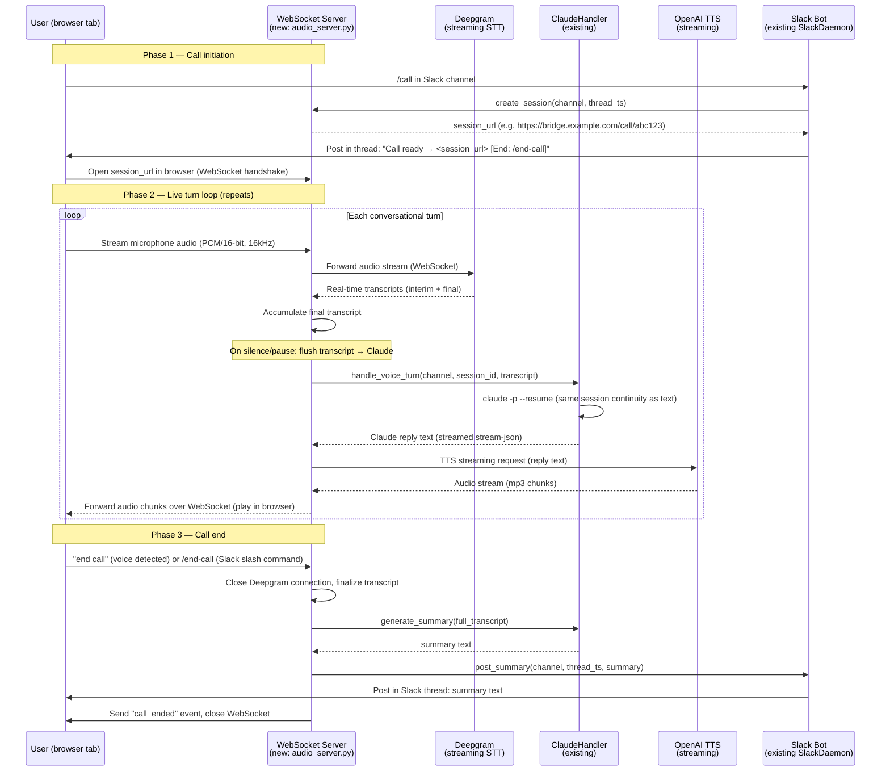

# Design: slack-phone-conversation — Live Voice Call with Claude in Slack

## Goal & Scope

*Per PRD summary:* Enable live, real-time voice conversations with Claude inside a Slack channel. Users initiate a phone-call-like session directly from Slack; both the user's voice and Claude's spoken responses are streamed in real time — creating a continuous, two-way voice call experience without leaving Slack.

*Per PRD:* The current bridge supports text only. Users who want a more natural, hands-free interaction have no way to hold a live spoken conversation with Claude within Slack. A round-trip of recorded audio clips is too slow and disjointed to feel like a real conversation.

**In scope (per PRD):**
- Start a live voice call from a Slack channel or DM via `/call` or a "Start Voice Call" shortcut
- Stream the user's speech to Claude in real time (continuous STT)
- Stream Claude's spoken reply back to the user in real time (low-latency TTS)
- Maintain conversational context for the full duration of the call
- Allow the user to end the call (voice: "end call" or text: `/end-call`) and receive a brief text summary in the channel

**Out of scope (per PRD):**
- Asynchronous voice-memo / audio-clip exchange
- Text-alongside-audio replies during the call
- Specific voice/accent preferences (use default TTS voice)
- Multi-user concurrent calls (deferred — no queuing or "busy" behaviour)
- Video or screen-share support

The primary users are developers and teams already using the Claude-Slack bridge who want a natural, hands-free interaction mode. The entry point is a Slack channel or DM where the bot is already present.

**Key design decisions made here** (deferred from PRD):
- Audio transport: **WebSocket-based browser client** served by the bridge (avoids PSTN complexity; works inside Slack as an external link to a lightweight web page)
- STT: **Deepgram real-time streaming API** (lowest published latency for continuous streaming)
- TTS: **OpenAI TTS streaming** (`tts-1` model, `mp3` streaming) (already part of the Anthropic ecosystem; low latency)
- Slack surface: **External link** — the bot posts a URL in the thread; the user opens it in a browser tab where the audio session runs. Slack does not have a native real-time audio embedding API, so this is the only viable approach without a Slack app extension.

---

## System Diagram



---

## Stack

| Component | Choice | Reason |
|---|---|---|
| Language / runtime | Python 3.12 (asyncio) | Consistent with all existing modules; async is essential for concurrent audio streaming |
| Audio transport | WebSocket (browser ↔ bridge) | No PSTN number needed; works cross-platform; browser MediaDevices API handles mic capture natively. Slack surfaces it as an external link — the user opens a browser tab |
| WebSocket + HTTP server | FastAPI + uvicorn | Async-native; clean WebSocket endpoint support (`@app.websocket`); runs on the same event loop as the existing asyncio daemon |
| Real-time STT | Deepgram streaming API | Lowest-latency continuous streaming STT with a Python WebSocket client (`deepgram-sdk`); interim results allow early transcript accumulation; alternatives (Whisper live, Google STT) have higher latency or require more infrastructure |
| TTS | OpenAI TTS streaming (`tts-1`) | Low-latency mp3 chunk streaming via the OpenAI Python SDK; `tts-1` is optimized for speed; ElevenLabs is higher quality but adds a new vendor; Anthropic ecosystem already uses OpenAI |
| Claude session continuity | `claude -p --resume` (existing `ClaudeHandler`) | Reuses the proven session-ID pattern; each voice call maps to a ClaudeHandler session just like a Slack thread, with the same `_sessions` dict keyed by `session_id` |
| Browser client | Vanilla HTML/JS (served by FastAPI as static file) | Minimal dependency; handles mic capture via `getUserMedia`, sends PCM over WebSocket, plays received audio chunks via Web Audio API. No React/build step needed for MVP |
| Slack slash command | Slack Bolt slash command handler in `SlackDaemon` | Reuses existing `AsyncApp`; `/call` registers a new command handler alongside the existing message event handlers |
| Config | `pydantic-settings` extension of existing `Config` | Adds `DEEPGRAM_API_KEY`, `OPENAI_API_KEY`, `AUDIO_SERVER_BASE_URL`, `AUDIO_SERVER_PORT` |
| Containerization | Extend existing `Dockerfile` / `docker-compose.yml` | Add port 8080 (audio WebSocket server); add `deepgram-sdk`, `openai`, `fastapi[standard]`, `uvicorn` to `requirements.txt` |

**Why WebSocket over WebRTC:** WebRTC offers lower latency but requires ICE/STUN infrastructure and is significantly harder to implement server-side in Python. WebSocket over a stable server connection is sufficient for this use case and far simpler to operate.

**Why Deepgram over Whisper live:** Deepgram's managed streaming API has a documented p50 latency of ~300ms for interim transcripts. Running Whisper live would require GPU-accelerated inference infrastructure beyond the scope of this bridge. Deepgram's free tier is sufficient for low-volume usage.

**Why OpenAI TTS over ElevenLabs:** OpenAI TTS streaming is available in the existing API ecosystem, has a simple chunk-streaming interface, and `tts-1` is specifically tuned for low latency. ElevenLabs produces higher-quality voice but at higher cost and an additional vendor relationship.

---

## File Changes / File Structure

```
src/
  main.py                  ← MODIFIED: start audio WebSocket server (uvicorn) alongside SlackDaemon
  config.py                ← MODIFIED: add DEEPGRAM_API_KEY, OPENAI_API_KEY,
                                        AUDIO_SERVER_BASE_URL, AUDIO_SERVER_PORT
  slack_daemon.py          ← MODIFIED: register /call and /end-call slash command handlers
  claude_handler.py        ← MODIFIED: add handle_voice_turn() and generate_summary() methods
  audio_server.py          ← NEW: FastAPI app with WebSocket endpoint for live audio sessions
  audio_session.py         ← NEW: per-call session state (STT stream, TTS client,
                                   transcript accumulation, silence detection)
  static/
    call.html              ← NEW: minimal browser client (mic capture, WebSocket,
                                   audio playback via Web Audio API)

.env.example               ← MODIFIED: document DEEPGRAM_API_KEY, OPENAI_API_KEY,
                                        AUDIO_SERVER_BASE_URL, AUDIO_SERVER_PORT

requirements.txt           ← MODIFIED: add deepgram-sdk, openai, fastapi[standard], uvicorn

docker-compose.yml         ← MODIFIED: expose port 8080 for audio server
                                         (or configurable via AUDIO_SERVER_PORT)

docs/
  phone-setup.md           ← NEW: guide for Deepgram account, OpenAI key, port
                                   configuration, and Slack slash command registration
```

### Key new/modified modules

**`audio_server.py` (new)**
FastAPI application with:
- `GET /call/{session_id}` — serves `call.html` (the browser client) with `session_id` embedded
- `WebSocket /call/{session_id}/ws` — audio bridge endpoint:
  1. Receives PCM audio bytes from the browser
  2. Forwards to Deepgram streaming connection
  3. Receives Deepgram final transcripts; calls `ClaudeHandler.handle_voice_turn()`
  4. Streams TTS audio chunks back to the browser
  5. Listens for `{"type": "end_call"}` JSON message to terminate the session

**`audio_session.py` (new)**
Encapsulates all per-call state:
- `session_id: str` — UUID generated at call creation
- `channel: str`, `thread_ts: str` — Slack context for posting summary
- `deepgram_ws: DeepgramWebSocket` — live STT connection
- `transcript_buffer: list[str]` — accumulated final transcript segments
- `claude_session_id: str` — maps to `ClaudeHandler._sessions` for `--resume`
- `is_active: bool` — guards against double-close on call end
- `close()` — teardown: close Deepgram WS, flush any pending TTS, trigger summary

**`claude_handler.py` (modified)**
Add two methods:
- `async handle_voice_turn(channel: str, session_id: str, transcript: str) -> str` — run `claude -p --resume <session_id>` with the transcript as the prompt; return the text reply (same `_run_claude` path, already stream-json)
- `async generate_summary(channel: str, session_id: str, full_transcript: str) -> str` — one-shot `claude -p` (no resume) with a system prompt asking for a 2–3 sentence summary

**`slack_daemon.py` (modified)**
Register two Slack Bolt handlers:
- `/call` slash command — creates a new `AudioSession`, stores it in `_active_calls: dict[str, AudioSession]` keyed by `channel+user`, posts the session URL to the channel thread
- `/end-call` slash command — looks up the active session for the caller, calls `session.close()`, triggers summary posting

**`config.py` (modified)**
```python
deepgram_api_key: str = ""
openai_api_key: str = ""
audio_server_base_url: str = ""   # e.g. https://bridge.example.com (public URL for session links)
audio_server_port: int = 8080
```

**`main.py` (modified)**
```python
await asyncio.gather(
    daemon.start(),                       # existing SlackDaemon
    uvicorn.Server(audio_config).serve(), # new audio WebSocket server
)
```

**`static/call.html` (new)**
Minimal single-page browser client (~150 lines):
- `navigator.mediaDevices.getUserMedia({audio: true})` — mic access
- `AudioWorkletProcessor` or `ScriptProcessorNode` — PCM capture at 16kHz
- `WebSocket` — sends raw PCM bytes, receives mp3 audio chunks and JSON control messages
- `AudioContext.decodeAudioData()` — plays received mp3 chunks in sequence
- Displays live transcript text and a "Hang up" button

---

## Limitations

- **Browser tab required.** Slack has no native real-time audio API for bot-posted content. The user must open an external link in a browser tab. This is the only viable approach without a dedicated Slack app (which requires app review and separate distribution). This is a known trade-off — noted in PRD open questions.
- **Public HTTPS endpoint required.** The audio WebSocket server must be reachable from the user's browser over HTTPS. In development, this requires ngrok or a similar tunnel; in production it requires a reverse proxy with TLS (e.g. nginx + Let's Encrypt). This is a deployment constraint, not a code issue.
- **Single active call per channel per user (MVP).** `_active_calls` is keyed by `channel+user`. Concurrency handling (second call while one is in progress) is deferred per the PRD.
- **Silence detection heuristic.** Flushing the transcript to Claude is triggered by a configurable silence timeout (e.g. 1.5 s of no Deepgram final transcript). This can feel sluggish in noisy environments. A more sophisticated voice-activity detection (VAD) approach is deferred.
- **Transcript accuracy.** Deepgram STT accuracy varies with accent, background noise, and technical vocabulary. This is a provider-side limitation with no code mitigation in this version.
- **TTS latency is bounded by Claude's reply time.** The time from end-of-speech to hearing Claude's response is: Deepgram final transcript latency + Claude inference time + OpenAI TTS chunk start. On a fast connection the Deepgram and TTS legs are each ~300–500 ms; Claude inference is the dominant variable (1–5 s depending on reply length).
- **Security: WebSocket session authentication.** The session URL contains a UUID (`/call/{session_id}/ws`). This is security-through-obscurity. A future iteration should add a short-lived token or require the user to be logged in. For MVP the UUID is sufficient given the short session lifetime.
- **"End call" voice detection is keyword-based.** The phrase "end call" is detected by searching the Deepgram transcript for that string. Ambiguous speech ("tend to call" etc.) could trigger a false positive. A dedicated wake-word model is out of scope.
- **No PRD pre-interview conducted.** The `mcp__claude-slack-bridge__ask_on_slack` MCP tool was unavailable in the current invocation context (agent-SDK call, not a direct Claude Code session). The PRD was found in the main repo's branch and used as the primary input. The open design decisions in the PRD (STT/TTS provider, audio transport, Slack surface) were resolved by the designer based on the constraints and existing stack. These choices should be confirmed with the user before implementation begins.
- **Open question (confirm before plan):** Is the Deepgram API key already available, or does the user need to create an account? Same for an OpenAI API key (may already exist for other uses).
- **Open question (confirm before plan):** Does the production deployment already have a public HTTPS endpoint, or does this feature's launch depend on one being set up?
